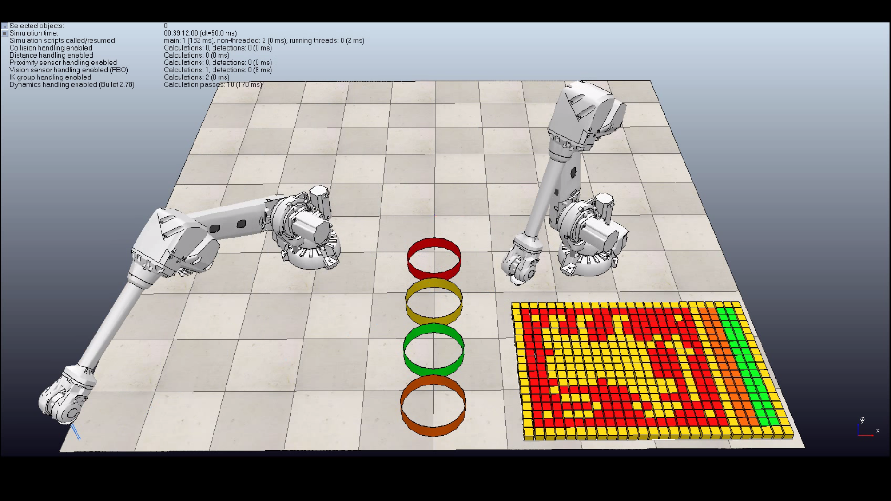

# Sri Lanka National Flag Design - CoppeliaSim - ROBOFEST 2021

## Introduction

* ROBOFEST 2021 is open to students from schools and universities. Students will be given a chance to participate in the competition by combining the practical application of science and technology with fun, intense energy, and excitement of a championship-sporting event.

* The Robot Simulator, [CoppeliaSim EDU](https://www.coppeliarobotics.com/) (Formerly known as V-rep) is used for the completion of the task. It is a software which is ideal for multi-robot application simulation and the controllers can be written in C/C++, Python, Java, Lua, Matlab or Octave.

* The controller for this task is written in [Matlab](https://www.mathworks.com/products/matlab.html)

## Completion of the task

* After simulating successfully, our team was able to complete the task as shown below: 

## Our Team

We are a team of 5 undergraduates at the Department of Electronic and Telecommunication Engineering, University of Moratuwa, Sri Lanka. Details of the team members can be found below.

#### Team Leader

[Tharuka Nilupul](https://github.com/TharukaN17)

#### Other Members

1. [Muhammad Aqeel](https://github.com/AqeelMuhammad)
2. [Laksara Thilakarathna](https://github.com/LaksaraThilakarathna)
3. [Tharindu Wijesinghe](https://github.com/Tharindu531)
4. [Isuru Wijethunga](https://github.com/IsuruWijethunga)
